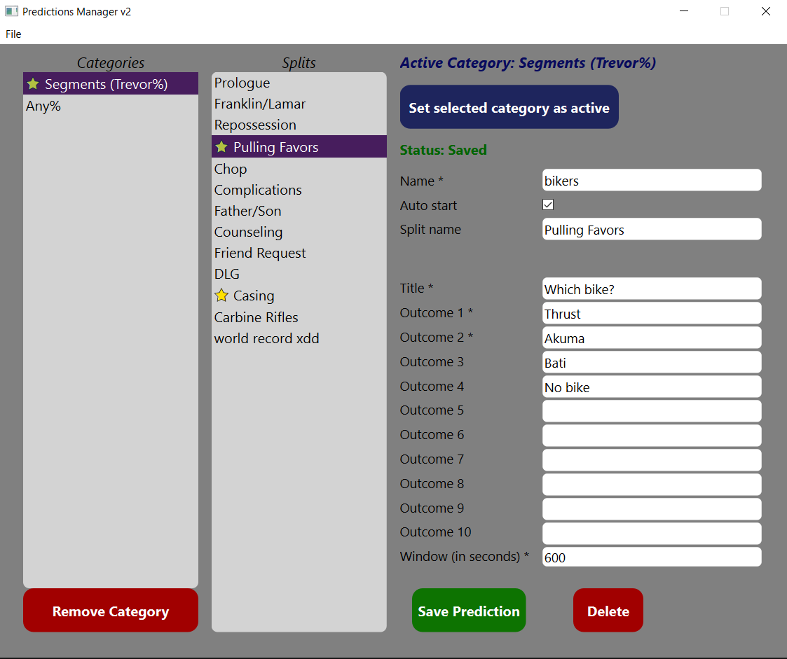
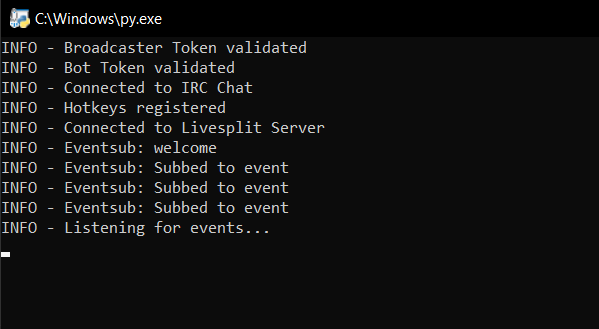

# electrobot

Twitch chat bot that manages predictions via chat commands and starts predictions based on Livesplit. Now with hotkey support.

# Prerequisites

- [Python](https://www.python.org/downloads/)
- [Livesplit](https://livesplit.org/downloads/) and [Livesplit Server](https://github.com/LiveSplit/LiveSplit.Server) (Optional)
- A Twitch account (Affiliate) (with 2FA enabled)
- A Twitch bot account

# Installation

1. Download the [latest release](https://github.com/electrorayer/electrobot/releases) and extract.
2. Install the necessary dependencies in the extracted folder:

    ```
    pip install -r requirements.txt
    ```
# Configuration

## Register Application

Since the bot runs locally you must [register your own app](https://dev.twitch.tv/docs/authentication/register-app/) with Twitch, this only takes a few minutes.
Follow their instructions and you should end up with an application in [your console](https://dev.twitch.tv/console/apps).

Once you see your application click on manage, then

1. Give the application a unique name
2. Set **OAuth Redirect URLs** to http://localhost:8777.
 The port doesn't really matter as long as it's not used elsewhere.
3. In **Category** choose Chat Bot.
4. Click I'm not a robot, then Save
5. Take note of the **Client ID**, you will need this shortly.
6. Click on **New Secret** and also note this down.
7. Save

## Config.toml

Open the `config` folder.

1. Copy `config-example.toml` and rename the copy to `config.toml`.
2. Open `config.toml` and change the value in `CLIENT_ID` to the client ID you noted down earlier.
3. Do the same thing with `CLIENT_SECRET` and `REDIRECT_URI`.
4. If you didn't use port 8777 you **MUST** also change the `PORT` field under `[socket]` as by default it is set to 8777.
5. Under `[irc]` change the value of `CHANNEL` to your Twitch channel. **NOTE**: this must be in lowercase.
6. Finally change the value of `BOT_ACCOUNT` to the Twitch channel of your bot.
7. Save

## Managing predictions

Run `manager_v2.pyw`

Here you can create predictions for every split for multiple categories



- **Add one or more categories:** click top left on File > Open and select 1 or more .lss files

- **Add or edit a prediction:** select your desired category/split, fill in the form and click Save Prediction

- **Delete a prediction:** select your desired category/split and click Delete

- **Make a category's predictions active:** select your desired category and click the blue button

The yellow stars indicate which category is active and which splits have predictions respectively.

*If you add splits often and you want to add a prediction for those splits you can rename any split in the `Splits` list to that split and make the prediction that way. The order or missing splits is irrelevant. The split list is more of a convenience feature. And if you want a prediction for every split well :(

## Hotkeys

When you first successfully run `electrobot.py` a bindings file will be created in `config/bindings.json` with some default hotkeys to perform below actions.

- Close a prediction with CTRL + 5
- Cancel a prediction with CTRL + 6
- Select an outcome <1-10> with CTRL + <1-4> *by default only the first four outcomes are made into a hotkey. You can go all the way up to 10 by just copy pasting the objects in the bindings file.

- You can change the actual keys you press by editing the `hotkey` field. [List of available keys](https://github.com/btsdev/global_hotkeys#list-of-the-available-keys)

# Usage

## Authorization

Run `authorize.py`. The script will ask you to authorize with a bot or streamer account and will then open your default browser. Make sure to authorize the correct account.

You need to run `authorize.py` **twice**, once for a streamer account and once for a bot account. You can use your streaming account as bot if you want to. Make sure the bot is a moderator in your channel.

If both accounts are authorized you should only need to rerun `authorize.py` if you change your Twitch password or disconnect the integration which you can do on [this page](https://www.twitch.tv/settings/connections) under **Other connections**.

## Livesplit

You can make predictions start automatically based on Livesplit splits by using the [Livesplit Server](https://github.com/LiveSplit/LiveSplit.Server) component. You know it works when you right click on Livesplit, Control and Start Server should be there. 

Make sure to start Livesplit Server **before** you start the bot.

If you added predictions with `manager_v2.pyw` a prediction should start when the given split name starts. 

The default port on which Livesplit Server runs is 16834, if you're using a different port, you must also change the port in `config.toml` under `[livesplit]`.

## Starting the bot

Run `electrobot.py`

If all was configured correctly you should see this:

- 

**Chat commands:**

The broadcaster and moderators can use these commands.
- Start predictions with `pred start <name>`
    - `name` must correspond to the `name` field of a prediction in `predictions.json`
- Lock predictions with `pred lock` or wait until the timer runs out
- Resolve predictions with `pred outcome <1-10>`
- Cancel predictions with `pred cancel`
- `!modcommands` shows this above list

**Examples:**
- 
- 
- 
- 
- 

- 
